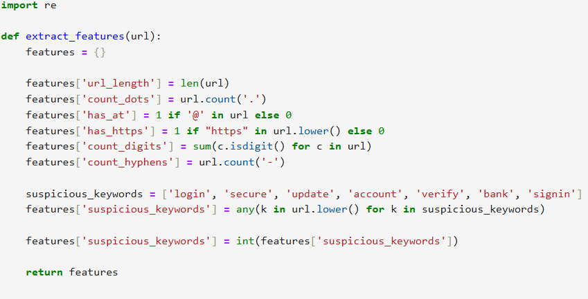
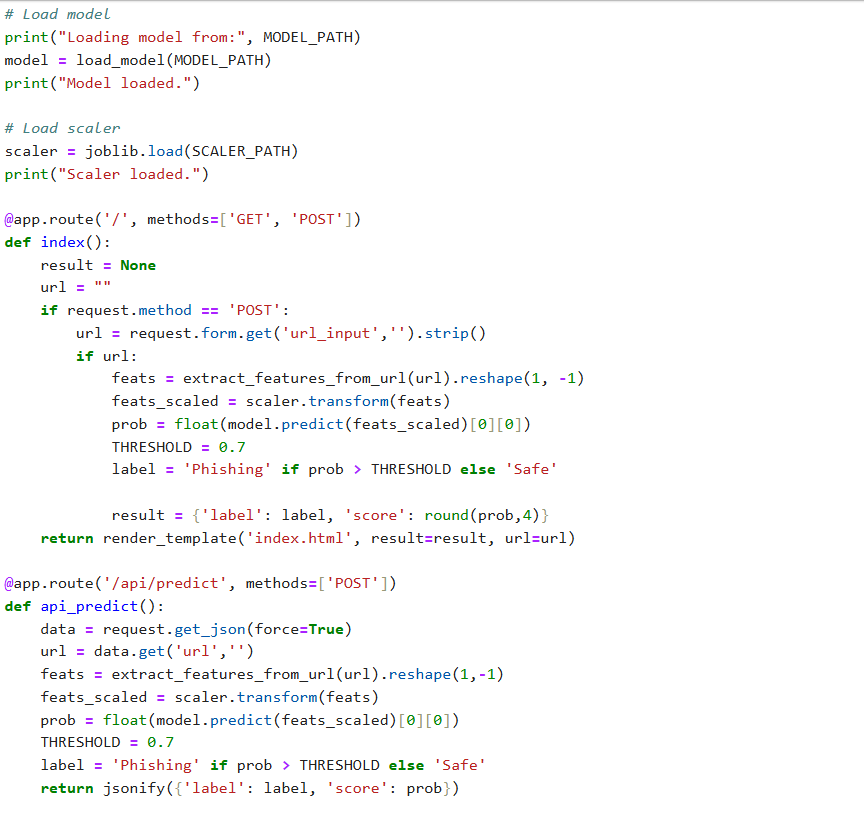
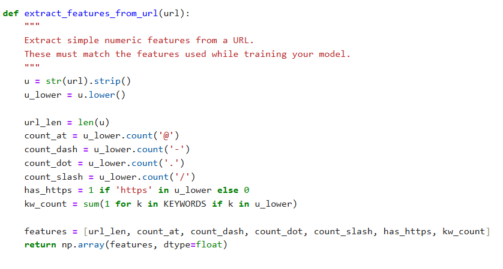
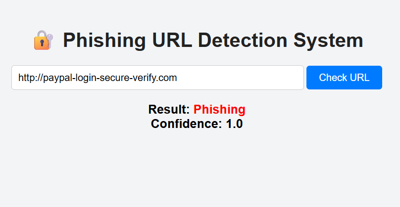

# 🔐 Phishing URL Detection System

A Machine Learning + Deep Learning based system to detect whether a given URL is Safe or Phishing.
The project includes:

✅ Dataset loading & preprocessing
✅ Feature engineering
✅ Model training (Neural Network)
✅ Scaling and saving model
✅ Flask web app for prediction
✅ Real-time URL classification

### 📌 Project Structure
Phishing_URL_detection/
│── models/
│   ├── phishing_model.h5
│   ├── scaler.pkl
│── src/
│   ├── app.py
│   ├── features.py
│── static/
│   ├── style.css
│── templates/
│   ├── index.html
│── dataset/
│── image/
│   ├── ss1.png
│   ├── ss2.png
│   ├── ss3.png
│   ├── ss4.png
│   ├── ss5.png
│   ├── ui-1.png
│   ├── ui-2.png
│── dataset_loader.ipynb
│── Phishing_url_detection_model.ipynb
│── safe_urls.csv
│── README.md

### 🚀 Features

Extracts multiple URL-based features

Neural network for binary classification

Flask web interface

Real-time predictions with confidence score

Supports additional safe URLs for better accuracy

### 📊 Technologies Used

Python

Pandas, NumPy

Scikit-Learn

TensorFlow / Keras

Flask

HTML, CSS

### 🧠 Model Workflow

1️⃣ Load phishing + safe dataset
2️⃣ Preprocess & clean labels
3️⃣ Extract features:

URL length

Number of digits, dots, hyphens

Presence of HTTP/HTTPS

Suspicious words (login, verify, bank, secure…)
4️⃣ Scale features using StandardScaler
5️⃣ Train Neural Network
6️⃣ Save model + scaler
7️⃣ Integrate with Flask for real-time detection

### 🖥️ How to Run the Project
Step 1 — Clone the Project

git clone https://github.com/YOUR_USERNAME/Phishing_URL_detection.git
cd Phishing_URL_detection

Step 2 — Create Environment

conda create -n phishing_env python=3.9
conda activate phishing_env

Step 3 — Install Required Libraries

pip install -r requirements.txt

Step 4 — Run the Flask App

cd src
python app.py

Step 5 — Open Web Browser

Visit:
👉 http://127.0.0.1:5000

### 🧪 API Usage (POST Request)

Endpoint:

/api/predict

Example:

{
  "url": "https://example.com/login"
}

Response:

{
  "label": "Phishing",
  "score": 0.83
}

### 📷 Demo Screenshot

Dataset loading

Feature Extraction Function

Flask Backend (app.py) Screenshot

features.py Screenshot

Web App Running Screenshot

### 🔮 Future Enhancements

Add WHOIS features

Use NLP on URL patterns

Deploy on cloud (AWS / Render / Railway)

Build Chrome extension

### 🤝 Contributions

Feel free to fork and contribute!

### ⭐ If you like this project, don’t forget to star the repo!